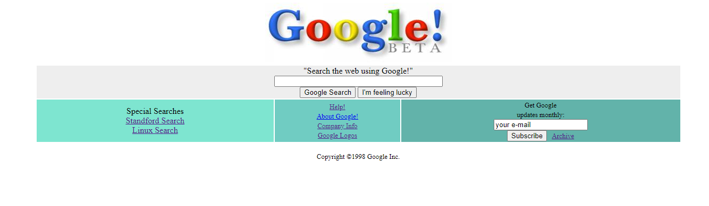

# Google'un ilk versiyonunu tasarladık.

Kurulduğu ilk yıllarda internet tasarımı için kullanılan bir dil olan HTML ile Google'nin kurucuları Larry Page ve Sergey Brin'nin basitçe tasarladıkları ana sayfa

